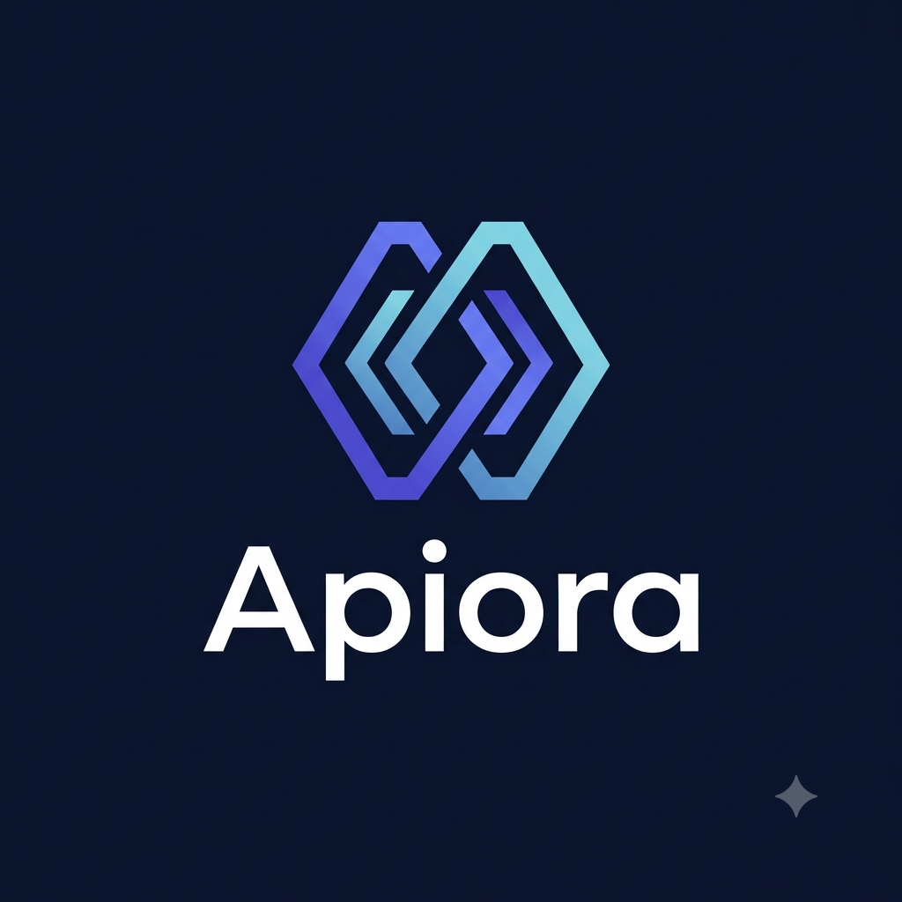

<div align="center">



# APIORA

### The Postman for AI Engineers — Universal Testing, Benchmarking & Diagnostics Laboratory

[](https://nextjs.org/)
[](https://www.typescriptlang.org/)
[](https://react.dev/)
[](https://api-forge-ai-ivory.vercel.app)
[](https://api-forge-ai-ivory.vercel.app/docs)
[](https://opensource.org/licenses/MIT)
[](https://owasp.org/www-community/attacks/Server_Side_Request_Forgery)
[](https://github.com/AgentNex/Apiora/pulls)

<p align="center">
  <a href="https://api-forge-ai-ivory.vercel.app"><strong>🚀 Explore Live Playground »</strong></a>
  &nbsp;&nbsp;•&nbsp;&nbsp;
  <a href="https://api-forge-ai-ivory.vercel.app/docs"><strong>📖 Full Documentation Portal »</strong></a>
  <br />
  <br />
  <a href="#-key-features">Key Features</a> •
  <a href="#-multi-model-arena">Model Arena</a> •
  <a href="#-request-pipelines">Pipelines</a> •
  <a href="#-full-documentation-portal">Documentation</a> •
  <a href="#-workspace-modes">Workspace Modes</a> •
  <a href="#-supported-providers--presets">Presets</a> •
  <a href="#-quick-start">Quick Start</a> •
  <a href="#-security--ssrf-defense">Security</a> •
  <a href="#-license">License</a>
</p>

</div>

---

## 🌟 Overview

**Apiora** (formerly *API Forge AI*) is a high-craft, production-grade developer laboratory engineered for testing, inspecting, and benchmarking LLM, Multimodal, and Speech/Audio model APIs. Built without heavy visual frameworks or proprietary SDK dependencies, Apiora provides native Web Streams, bidirectional formatting, SSRF-hardened serverless proxying, and pure CSS ambient motion.

> 🚀 **Live Production Application**: [https://api-forge-ai-ivory.vercel.app](https://api-forge-ai-ivory.vercel.app)  
> 📖 **Full Interactive Documentation**: [https://api-forge-ai-ivory.vercel.app/docs](https://api-forge-ai-ivory.vercel.app/docs)

---

## ✨ Key Features ("The Postman for AI")

- 🏟️ **Multi-Model Comparison Arena**: Broadcast the exact same prompt to 2–4 models simultaneously (e.g. GPT-4o vs Claude 3.5 Sonnet vs Gemini 1.5 Pro vs DeepSeek R1). Compare TTFB, tokens/sec throughput, latency, and cost side-by-side.
- ⛓️ **Request Chaining & Sequential Pipelines**: Define multi-step workflows where output from Step 1 feeds into subsequent prompts using `{{step_1.output}}` template interpolation.
- 💰 **Live Token & Cost Calculation Engine**: Real-time token counter and pre-execution cost estimation powered by an embedded model pricing catalog. Running session expenditure counter logged in the navigation bar.
- ⚡ **Native Web Streams Engine & Timeline Waterfall**: Progressive real-time token rendering via SSE (`text/event-stream`) and NDJSON with chunk waterfall inspector, inter-chunk latency distribution, and `AbortController` cancellation.
- 💻 **Multi-Language SDK Code Exporter**: Instant copyable code snippets in **cURL**, **Python (SDK & Requests)**, **TypeScript (SDK & Fetch)**, **Go (`net/http`)**, and **Rust (`reqwest`)**.
- 🧪 **Automated Response Test Assertions**: Configure test rules (Status Code = 200, Latency < 2000ms, Body Contains String, Valid JSON Schema) evaluated automatically on every response.
- 📜 **Prompt Versioning & Visual Diff**: Save named iterations of your prompts and view side-by-side character/word diffs with one-click restoration.
- ⌨️ **Global Command Palette (`⌘K` / `Ctrl+K`)**: Rapid search and jump to any model preset, workspace tab, or action from anywhere in the app.
- 🛡️ **SSRF-Protected Proxy Gateway & Local-Only Mode**: Integrated serverless route (`/api/proxy`) validating outbound target IP addresses against RFC1918 private subnets and metadata IPs, plus a dedicated **Local-Only Mode** toggle for direct browser fetches.
- 💾 **Data Portability & Backup JSON**: One-click complete export and import of all History, Saved Collections, and Environments (`apiora_backup_v1.json`).
- 📱 **PWA & Mobile-First Responsive Design**: Installable on desktop & mobile devices with slide-over drawers, segmented touch controls, and container queries.

---

## 🏟️ Multi-Model Comparison Arena

Apiora enables simultaneous multi-model benchmarking in real time:

1. Dispatch 1 prompt across up to 4 models concurrently.
2. Observe parallel token streaming in responsive grid cards.
3. Compare **TTFB (Time to First Byte)**, **Throughput (Tokens/sec)**, **Total Duration**, and **Estimated Cost ($)**.

---

## ⛓️ Request Pipelines & Chaining

Build sequential AI agent steps directly in the browser:
- **Step 1 (Summarizer)**: Summarizes input text with OpenAI GPT-4o.
- **Step 2 (Entity Extractor)**: Feeds `{{step_1.output}}` into Claude 3.5 Sonnet to extract structured JSON.
- **Step 3 (Translator)**: Feeds `{{step_2.output}}` into Gemini 1.5 Flash to translate output.

---

## 📖 Full Documentation Portal

The full, interactive developer documentation portal is hosted live at **[https://api-forge-ai-ivory.vercel.app/docs](https://api-forge-ai-ivory.vercel.app/docs)**.

### 📚 Documentation Chapters:
1. **[Overview & Architecture Philosophy](https://api-forge-ai-ivory.vercel.app/docs#overview)**
2. **[30-Second Quickstart Guide](https://api-forge-ai-ivory.vercel.app/docs#quickstart)**
3. **[Workspace Modes](https://api-forge-ai-ivory.vercel.app/docs#workspace-modes)**
4. **[Supported Providers & Presets](https://api-forge-ai-ivory.vercel.app/docs#presets)**
5. **[Multi-Model Comparison Arena](https://api-forge-ai-ivory.vercel.app/docs#arena)**
6. **[Chained Pipelines & DAG](https://api-forge-ai-ivory.vercel.app/docs#pipelines)**
7. **[Live Token & Cost Calculation Engine](https://api-forge-ai-ivory.vercel.app/docs#cost-calculator)**
8. **[Speech & Audio STT Presets](https://api-forge-ai-ivory.vercel.app/docs#speech-audio)**
9. **[Real-Time Streaming Engine](https://api-forge-ai-ivory.vercel.app/docs#streaming)**
10. **[Response Inspector & JSON Tree](https://api-forge-ai-ivory.vercel.app/docs#response-inspector)**
11. **[Response Test Assertions](https://api-forge-ai-ivory.vercel.app/docs#assertions)**
12. **[Multi-Language SDKs](https://api-forge-ai-ivory.vercel.app/docs#code-export)**
13. **[Security & SSRF Defense](https://api-forge-ai-ivory.vercel.app/docs#security)**
14. **[Dynamic Environments & Variables](https://api-forge-ai-ivory.vercel.app/docs#environments)**
15. **[Local Persistence & Backup JSON](https://api-forge-ai-ivory.vercel.app/docs#indexeddb)**
16. **[Keyboard Shortcuts & Cmd+K](https://api-forge-ai-ivory.vercel.app/docs#shortcuts)**
17. **[Proxy API Specification](https://api-forge-ai-ivory.vercel.app/docs#proxy-api)**

---

## 🔌 Supported Providers & Presets

| Provider / API | Mode | Category | Streaming |
| :--- | :--- | :--- | :---: |
| **OpenAI Chat Completions** | Chat | Major Providers | ✅ Yes |
| **Anthropic Messages** | Chat | Major Providers | ✅ Yes |
| **Google Gemini Generate Content** | Multimodal | Major Providers | ✅ Yes |
| **DeepSeek API (V3 / R1)** | Chat / Reasoning | OpenAI Compatible | ✅ Yes |
| **Groq Cloud LPU** | Inference | OpenAI Compatible | ✅ Yes |
| **OpenRouter Gateway** | Multi-Provider | OpenAI Compatible | ✅ Yes |
| **Mistral AI** | Chat | Major Providers | ✅ Yes |
| **Together AI** | Open Source | OpenAI Compatible | ✅ Yes |
| **Cohere Chat v2** | Enterprise | Major Providers | ❌ No |
| **Speechmatics STT (Async Job)** | Speech-to-Text | Speech & Audio | ❌ No |
| **Deepgram Nova-2 (Audio URL)** | Speech-to-Text | Speech & Audio | ❌ No |
| **Groq Whisper (Audio Transcribe)** | Speech-to-Text | Speech & Audio | ❌ No |
| **Generic REST JSON** | Custom | Custom | Customizable |

---

## 🔒 Security & SSRF Defense

1. **Strict SSRF Validation**: All target URLs routed through `/api/proxy` are checked against private IP ranges:
   - RFC1918 Private Subnets (`10.0.0.0/8`, `172.16.0.0/12`, `192.168.0.0/16`)
   - Loopback Addresses (`127.0.0.0/8`, `::1`, `localhost`)
   - Cloud Metadata IPs (`169.254.169.254`, `metadata.google.internal`)
   - Prohibited URL Schemes (Only `http:` and `https:` allowed).
2. **Local-Only vs Proxy Mode**: Choose whether outbound requests travel through the SSRF-hardened serverless function or execute directly from your browser via native `fetch()`.
3. **Session-Only Memory**: API keys are retained exclusively in active browser memory by default and are masked in request previews and code exports.

---

## 🚀 Quick Start

### 1. Clone the Repository
```bash
git clone https://github.com/AgentNex/Apiora.git
cd Apiora
```

### 2. Install Dependencies
```bash
npm install
```

### 3. Run Automated Tests
```bash
npm test
```

### 4. Start Development Server
```bash
npm run dev
```
Open [http://localhost:3000](http://localhost:3000) in your browser.

### 5. Build for Production
```bash
npm run build
npm run start
```

---

## ⌨️ Keyboard Shortcuts

| Shortcut | Action |
| :--- | :--- |
| **`Cmd + K`** / **`Ctrl + K`** | Open Global Command Palette |
| **`Ctrl + Enter`** / **`Cmd + Enter`** | Send API Request |
| **`Escape`** | Abort Active Stream / Close Modals |
| **`Ctrl + Shift + F`** | Auto-Format JSON (in Raw JSON / REST mode) |
| **`Tab`** | Insert 2-space soft indentation (in JSON editor) |

---

## 📄 License

Distributed under the **MIT License**. See `LICENSE` for more information.

---

<div align="center">
  <sub>Built with ❤️ by <a href="https://github.com/AgentNex">AgentNex</a>. Powered by Next.js & Web Streams.</sub>
</div>
